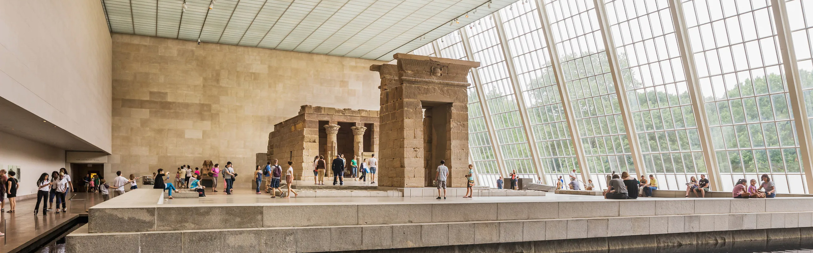
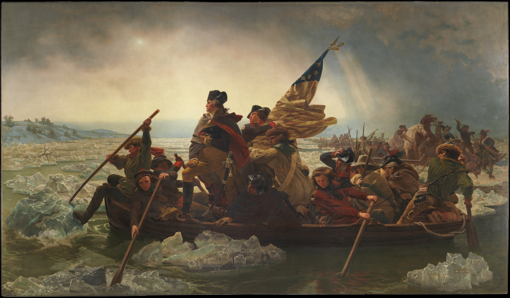

  
  
Temple of Dendur (10 BCE)

# A Familiar Story

Your parents are in town. It's raining, so your plan to pleasantly stroll through Central Park and watch tourists row backwards on the Lake is squashed. Spurred on by your dad's claim that he's "always wanted to see *Washington Crossing the Delaware*," you decide on [the Met](https://www.metmuseum.org/) as your alternative activity. 

  
  
<em>Washington Crossing the Delaware</em>, Emanual Leutze (1851)

But, after flashing your New York driver's license at the admissions desk for free entry and entering one of the world's most esteemed art museums, you discover your next problem: it's huge. HUGE huge. With more than **600,000 square feet of gallery space**, it's not only the 8th most visited art museum, but also the **4th largest in the world** (beaten only by the [Louve](https://www.louvre.fr/en), the [State Hermitage Museum](https://www.hermitagemuseum.org/wps/portal/hermitage/) in Saint Petersburg, and the [National Museum of China](https://en.chnmuseum.cn/)). 

How can you make sense of this vast collection of art available to you? Where do you start?

  
  
Good luck getting from the Temple of Dendur to JMW Turner

# Motivation: Making Sense of the Met

This project was inspired by experiences many of us have had while visiting the Metropolitan Museum of Art, be it as first-time visitors or regular attendees (thanks to pay-as-you-wish entry for NY students). The museum houses some of the world's greatest art, but its scale, architectural complexity, and never-ending acquisitions make it challenging to get a sense of what the collection actually contains.

Motivated by the intimidating vastness of the Met (and likely, our pride in it as New York City residents), this analysis aims to provide a high-level overview of art at the Met, explore how the museum's collection has changed over time, visualize the global sources of its works, and dive into one its most well-known departments: Egyptian Art. Our overarching goal is to both help future visitors feel more prepared for a trip to the Met and give those not in New York a sense of its impressive collection from a distance. 

^ INSERT LINKS ONCE NAMES OF THESE HTML PAGES IS FINALIZED

* exploring_departments
* growing_collection
* around_the_world
* Egypt

  
  
Greek Art (6th–4th Century BC)

# Related Work

Our discovery of how fun and satisfying it is to make and use interactive plots in R (such as with [plotly](https://plotly.com/r/)) drew us to a topic that would have lots of opportunities for visualization. Additionally, a few members of our group have specific experience with spatial epidemiology, so working with data like this that allows for map creation was a good fit for our academic backgrounds.  