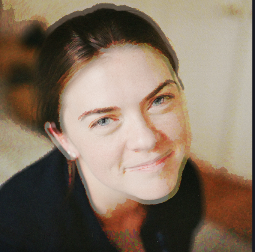

We are a group of Masters & PhD students at Columbia University who worked diligently to curate The Met Art Data for this website.

<!-- ####### BLOCK 1 START ######### -->

  
  
Jennifer in Vincent Van Gogh style

# Jennifer Osei

*MS Biostatistics | Theory and Methods*   

**Contributions:**   * Website Development and Coding (.r,.html,.css)   * Project Concept Creativity    * Home & Curator Pages    * Project Report  

**Jennifer** is a MS Biostatistics student at Columbia University. From Buffalo, NY, she loves cold weather (she thinks...), playing tennis, and singing. Jennifer's passionate about using data to improve healthcare. She loves music and would love to try and play the violin one day! In her free time she enjoys random NYC adventures and would love to ACTUALLY visit The Met .....one day.... hopefully using the maps in this project to explore after finals hehe :).  
<!-- ####### BLOCK 1 END ############ -->

<!-- ####### BLOCK 2 START ######### -->

  
  
Melike in Impressionist Style

# Melike Aksoy

*MPH Biostatistics | Advanced Epidemiology*   

**Contributions:**   * Art Around the World dashboard   * Project Report 

**Melike** is a second-year MPH Biostatistics student. She is from New Jersey. Melike currently works as a research assistant at Department of Neurology in Columbia Medical Center. She loves traveling, taking photos, spending time with her cats, coloring, reading books, and  hiking. Her favorite artist is Monet and her favorite department is 19th and Early 20th Century European Paintings And Sculpture. She likes to collect books, postcards, and prints of Monet's art. 
<!-- ####### BLOCK 2 END ############ -->

<!-- ####### BLOCK 3 START ######### -->
# Emily Murphy

  
  
Emily in the Impressionist Era

*MPH Epidemiology | Infectious Disease Epidemiology*   

**Contributions:**   * Project Motivation Page   * Curators Page   * Screencast  

**Emily** is a second-year MPH student in the Epidemiology department. She's from Alexandria, VA, and is particularly interested in zoonoses and emerging infectious diseases. Her favorite artist at the Met is JMW Turner, but she thinks  [<em>Whalers</em>](https://www.metmuseum.org/art/collection/search/437854) is overrated. 
<!-- ####### BLOCK 3 END ############ -->

<!-- ####### BLOCK 4 START ######### -->
# Diana Hernandez

  
  
Diana as a pencil sketch

*MPH Sociomedical Sciences | Biostatistics*  

**Contributions:**   * Exploring the Met's Departments page   * The Data page  

**Diana** is a second-year MPH student in the Sociomedical Sciences department. She's from Miami Beach, FL and loves sunshine. She has been to the Met many times but still gets lost any time she visits. Her favorite department in the Met is [Arms and Armor](https://www.metmuseum.org/about-the-met/collection-areas/arms-and-armor). She says it's a cool department with a cool department name.
<!-- ####### BLOCK 4 END ############ -->

<!-- ####### BLOCK 5 START ######### -->
# Aleya Khalifa

  
  
Aleya on a hike in watercolor

*PhD Epidemiology*   

**Contributions:**   * The Met's Growing Collection dashboard & report   * Data cleaning  

**Aleya** is a PhD Candidate in the Department of Epidemiology studying the impact of mobility on the HIV epidemic. She loves visiting museums on a rainy New York day. She loves data science even more.

<!-- ####### BLOCK 5 END ############ -->

<!-- ####### BLOCK 6 START ######### -->
# Andy Turner

  
  
Andy in Snow by Georges Seurat

*MPH Epidemiology | Advanced Epidemiology*  

**Contributions:**  * Finding the intial dataset   * ShinyApp Creation    *  Egyptian Artifacts Analysis  

**Andy** is a second year Masters student in Epidemiology with a Certificate in Advanced Epidemiology (all Epi all the time!). Andy currently works as a Research Assistant focusing on Sexual and Gender Minorities in the United States and Kenya. They are from Las Vegas, Nevada, so fine art runs directly counter to their upbringing. Andy has been to the Met exactly one time, and they were overwhelmed. That said, there were a few cool looking chairs. 

<!-- ####### BLOCK 6 END ############ -->

