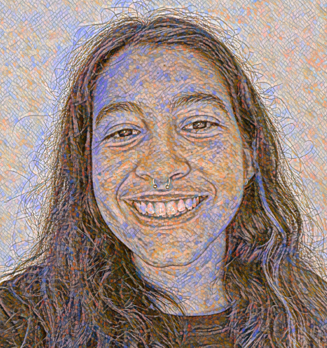

We are a group of Masters & PhD students at Columbia University who worked diligently to curate Met art data for this website!

<!-- ####### BLOCK 1 START ######### -->

 { width=35% }

**Jennifer A. Osei**   *MS Biostatistics | Theory and Methods*   
**Contributions:**   * Website Development and Coding (.html,.css)   * Project Concept Creativity    *  Statistical Analysis (pending)    * Screencast (pending)

**Jennifer** is an MS Biostatistics student at Columbia University. From Buffalo, NY, she loves cold weather (still thinking about it), playing tennis, and singing. Jennifer's passionate about using data to assess and tailor programs to improve health. She loves music and would love to try and play the violin one day! In her free time she enjoys random NYC adventures and would love to ACTUALLY visit The Met .....one day.... hopefully using the maps in this project to explore after finals hehe :).
<!-- ####### BLOCK 1 END ############ -->

<!-- ####### BLOCK 2 START ######### -->

 { width=35% }

**Melike Aksoy**
**Contributions:** [Insert Your Contributions here]
**Melike** [Insert Yor Bio Here]
**Personal Website / Contact Info** 
<!-- ####### BLOCK 2 END ############ -->

<!-- ####### BLOCK 3 START ######### -->

 { width=35% }

**Emily Murphy**   *MPH Epidemiology | Infectious Disease Epidemiology*   
**Contributions:**   * Project Motivation Page   * Screencast (pending)    *  Project Admin: cleaning up the directory, communicating about to-dos, note-taking during meetings  
**Emily** is a second-year MPH student in the Epidemiology department. She's from Alexandria, VA, and is particularly interested in zoonoses and emerging infectious diseases. Her favorite artist at the Met is JMW Turner, though she doesn't particularly like [<em>Whalers</em>](https://www.metmuseum.org/art/collection/search/437854). 
<!-- ####### BLOCK 3 END ############ -->

<!-- ####### BLOCK 4 START ######### -->

 { width=35% }

**Diana Hernandez** *MPH Sociomedical Sciences | Biostatistics*  
**Contributions:**   * Exploring the Met's Departments page   * The Data page  
**Diana ** is a second-year MPH student in the Sociomedical Sciences department. She's from Miami Beach, FL and loves sunshine. She has been to the Met many times but still gets lost any time she visits. Her favorite department in the Met is [Arms and Armor](https://www.metmuseum.org/about-the-met/collection-areas/arms-and-armor). She says it's a cool department with a cool department name.
<!-- ####### BLOCK 4 END ############ -->

<!-- ####### BLOCK 5 START ######### -->

 {width=35% }

**Aleya Khalifa**
**Contributions:** [Insert Your Contributions here]
**Aleya** [Insert Yor Bio Here]
**Personal Website / Contact Info** 
<!-- ####### BLOCK 5 END ############ -->

<!-- ####### BLOCK 6 START ######### -->

 {width=35% }

**Andy Turner**   *MPH Epidemiology | Advanced Epidemiology*   
**Contributions:**  * Finding intial dataset   * ShinyApp Creation    *  Egyptian Artifacts Analysis  
**Andy** is a second year Masters student in Epidemiology with a Certificate in Advanced Epidemiology (all Epi all the time!). Andy currently works as a Research Assistant focusing on Sexual and Gender Minorities in the United States and Kenya. They are from Las Vegas, Nevada, so fine art runs directly counter to their upbringing. Andy has been to the Met exactly one time, and they were overwhelmed. That said, there were a few cool looking chairs. 
<!-- ####### BLOCK 6 END ############ -->

