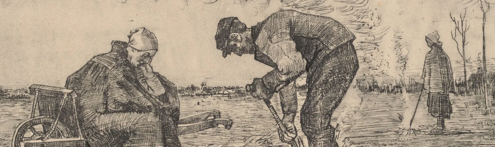
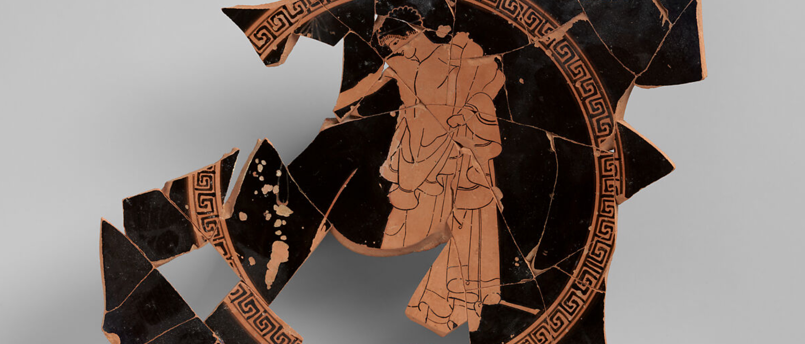
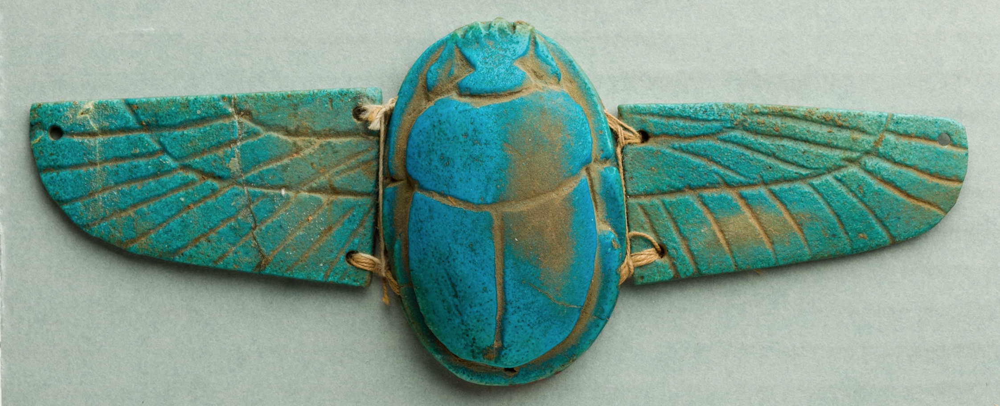
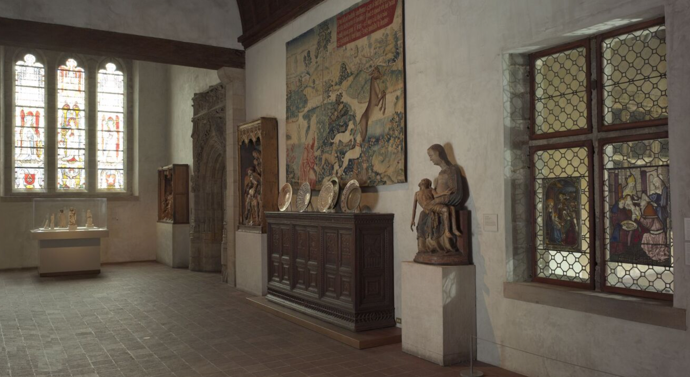
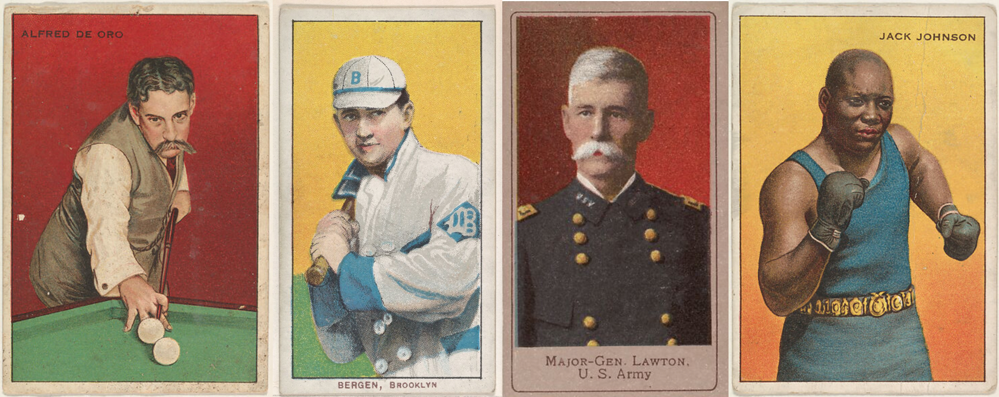
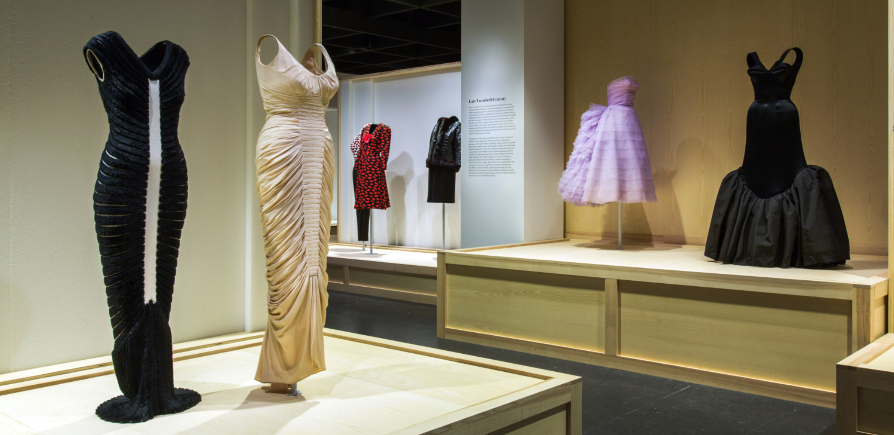
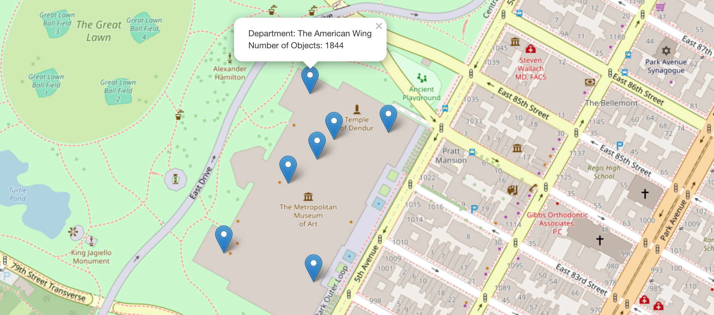

# Project Motivation & Related Work
## A Familiar Story

Your parents are in town. It's raining, so your plan to pleasantly stroll through Central Park and watch tourists row backwards on the Lake is squashed. Spurred on by your dad's claim that he's "always wanted to see *Washington Crossing the Delaware*," you decide on [the Met](https://www.metmuseum.org/) as your alternative activity. 

But, after flashing your New York driver's license at the admissions desk for free entry and entering one of the world's most esteemed art museums, you discover your next problem: it's huge. HUGE huge. With more than **600,000 square feet of gallery space**, it's not only the 8th most visited art museum, but also the **4th largest in the world** (beaten only by the [Louve](https://www.louvre.fr/en), the [State Hermitage Museum](https://www.hermitagemuseum.org/wps/portal/hermitage/) in Saint Petersburg, and the [National Museum of China](https://en.chnmuseum.cn/)). 
How can you make sense of this vast collection of art available to you? Where do you start?

<div style="text-align:center;">
  <a href="https://www.ronankellydesign.com/wp-content/uploads/2020/10/MetMap5.gif" target="_blank">
    
  </a>
  <p style="font-size: smaller;">Good luck getting from the Temple of Dendur to JMW Turner</p>
</div>

## Project Motivation

This project was inspired by experiences many of us have had while visiting the Metropolitan Museum of Art, be it as first-time visitors or regular attendees (thanks to pay-as-you-wish entry for NY students). The museum houses some of the world's greatest art, but its scale, architectural complexity, and never-ending acquisitions make it challenging to get a sense of what the collection actually contains.

Motivated by the intimidating vastness of the Met (and likely, our pride in it as New York City residents), this analysis aims to outline the [most common contents of its departments](exploring_departments.html), explore [how the museum's collection has changed over time](growing_collection_dashboard.html), visualize the [global sources of its works](around_the_world.html), and dive into one its most well-known departments: [Egyptian Art](https://lakerss12.shinyapps.io/shiny_app/). Our overarching goal is to both help future visitors feel more prepared for a trip to the Met and give those not in New York a sense of its impressive collection from a distance.

## Related Work

Our discovery of how fun and satisfying it is to make and use interactive plots in R (such as with [plotly](https://plotly.com/r/)) drew us to a topic that would have lots of opportunities for visualization. Additionally, a few members of our group have specific experience with spatial epidemiology, so working with data like this that allows for map creation was a good fit for our academic backgrounds.

# Initial Questions

After deciding to focus our analysis on the Met, we began asking some initial questions. At this point, the contents of both the Met and its dataset remained pretty unknown, so are questions were general ones motivated by our confusion as visitors. They included:

* *What exactly does the Met contain?*
* *Where does the museum art come from in terms of cultures, dynasties, and time?*
* *How can we explore the Met more easily?*

Once we discovered the vastness of the available data and the significant missingness present for many of its variables, we knew we had to narrow our focus. We decided to work with the variables with the most complete data and refined our questions to be more specific, based on the information we knew would be available:

* *What kind of objects does each department hold?*
* *With Egyptian Art being so popular, what do its objects tell us?*
* *How has the Met changed over time? What do trends in acquisitions look like?*
* *Where in the world does the art in the Met come from?*

# Data Collection and Cleaning

```{r setup, include = FALSE}
library(tidyverse)
library(ggplot2)
library(plotly)

load("data/met_10.RData")
load("data/met.RData")

mypal = c("#78B7C5",  "#EBCC2A", "#FF0000", "#EABE94", 
         "#3B9AB2", "#B40F20", "#0B775E", "#F2300F", 
         "#5BBCD6", "#F98400", "#ab0213", "#E2D200", 
         "#ff7700", "#46ACC8", "#00A08A", "#78B7C5",
         "#a7ba42", "#f94f8a", "#DD8D29")
```

## Data Source

Since its beginning in 1870, The Metropolitan Museum (The Met) has acquired and displayed over 5,000 years worth of art work from around the world. 

Thankfully for us data scientists, The Met offers open access to data of its collection. They did this to encourage interaction with the museum's collection, and to help people around the world to use the wealth of data they have stored on an impressive number of artefacts. The dataset can be found [here](https://github.com/metmuseum/openaccess), for anyone interested in running their own analyses or reproducing ours. 

## Generating our Sample

The Met dataset consists of over 400,000 artistic pieces. If you think the Met is overwhelming to get through now - just imagine if all of the artworks in storage were also on display. Sadly a dataset of this size is too much even for us art aficionados, so we decided to divide and conquer (which, fittingly, is how many of the artifacts from around the world ended up in an American art museum). 

A dataset of this size is far too big to handle, as any analysis would take an excessively long time to process. Given this scale, we decided that it would be wise to just work with a smaller, more manageable subset of the data.

Using the code below, we took a random sample of 10% of the data, creating our final dataset of over 40,000 observations. You can use this code to create the same subset we did from The Met's raw data file `MetOBjects.txt`:

    -   `set.seed(1)`

    -   `met_10 <- sample_n(MetOBjects, nrow(MetOBjects)*.10)`

    -   `save(met_10, file = "data/met_10.RData")`
    
Once we had our 10% sample (amounting to `r format(nrow(met_10), big.mark=",")` observations), we embarked on some data cleaning.

## Checking for Completeness

First, we looked into which variables were the most complete, based percentage of works having data recorded for that characteristic. 

The following table shows the % completeness for all variables. 
```{r}
met_10 <- met_10 %>% 
  janitor::clean_names()

data.frame(sapply(met_10, function(x) round(sum(!is.na(x))/nrow(met_10)*100,2))) %>%
  magrittr::set_colnames("Completeness") |> 
  arrange(desc(Completeness)) |> 
  head(15)
```

Across all observations, `object_name` and `accession_year` were some of the most complete. `department` was 100% complete. This informed which analytic questions we could answer.

Based on the missing data table and our decision to focus on objects and years, we once again limited the dataset to those observations with complete object and year data - resulting in a final analytic dataset with `r format(nrow(met), big.mark=",")` observations and `r format(ncol(met), big.mark=",")` variables.

All in all, we chose the following variables to work with: 

* `department`: Indicates The Met's curatorial department responsible for the artwork
* `accession_year`: Year the artwork was acquired
* `culture`: Information about the culture, or people from which an object was created
* `object_name`: Describes the physical type of the object
* `country`: Country where the artwork was created or found
* `subregion`: Geographic location more specific than Region, but less specific than Locale, where the artwork was created or found
* `object_begin_date`: Date indicating the year the artwork was started
* `object_end_date`: Date indicating the year the artwork was completed
* `dynasty`: Dynasty (a succession of rulers of the same line or family) under which an object was created

## Cleaning Up Categorization

With the scope of our analytic dataset decided, we now turned our attention to the actual contents of the included variables. 

### Object Name

First, we noticed that the values in `object_name` were far too detailed for our purposes. For example, who needs to differentiate between a relief fragment from the _Tomb of Maketre_ and a relief fragment form the _Tomb of Nespekashuty_? If you want to, don't run the code below. But we consolidated object types, like _reliefs_, to create simpler and clearer summaries.

```{r}
met <- met %>%
  mutate(object_name = ifelse(
    grepl("Textile", object_name), "Textile",
    ifelse(grepl("Painting", object_name), "Painting",
    ifelse(grepl("Relief", object_name), "Relief",
    ifelse(grepl("Print", object_name), "Print", 
           ifelse(grepl("aseball card", object_name), "Baseball card", 
                  ifelse(grepl("Vase", object_name), "Vase", 
                         ifelse(grepl("rnament", object_name), "Vase", 
                                ifelse(grepl("arring", object_name), "Earring", 
                                       ifelse(grepl("ecklace", object_name), "Necklace", 
                                              ifelse(grepl("hotograph", object_name), "Photograph", 
                                                     ifelse(grepl("tatue", object_name), "Statue", 
           object_name))))))))))))
```

### Dynasty

As we transported ourselves to Ancient Egypt and the Met's many excavations in the area, we had to take some additional steps to dust off the data without hurting the artifacts. `Dynasty` was a key variable for the Egyptian data; because the Egyptian Art Department is the only Department in the Met to have fairly well-identified dynasties, we felt it was important to include it. However, instead of keeping to the traditional 30 Dynasties of Egypt, many of the observations were coded as "Dynasty 1-5" or "second half 11." 

To harmonize the `Dynasty` variable, we used the following strategy: 

* If the intended dynasty was easily identifiable from the name, we recoded the variable to said dynasty
* If the value was of a consecutive dynasty (for example, "Dynasty 12-13"), we kept the value the same, but only if that specific value was common in the data (n>20). This was to prevent having 50+ dynasty ranges and making visualization tedious. 
* If the value was of an infrequently occurring consecutive dynasty, or for larger dynastic range, we recoded the variable to "Dynasty Range"
* Any other values were coded as NA

Some other minor cleaning of the Egyptian data also occurred for object creation dates.

```{r}
met_egypt = met |> 
  filter(department == "Egyptian Art") |> 
 mutate(
    dynasty = case_when(
      dynasty == "11" ~ "Dynasty 11",
      dynasty == "Dynasty 1, 3–4" | dynasty == "Dynasty 1 3-4" ~ "Dynasty Range",
      dynasty == "Dynasty 11, late" ~ "Dynasty 11",
      dynasty == "Dynasty 11?" ~ "Dynasty 11",
      dynasty == "Dynasty 11–13" | dynasty == "Dynasty 11-13" ~ "Dynasty Range",
      dynasty == "Dynasty 11–17" | dynasty == "Dynasty 11-17" ~ "Dynasty Range",
      dynasty == "Dynasty 11-17" ~ "Dynasty Range",
      dynasty == "Dynasty 11–18" ~ "Dynasty Range",
      dynasty == "Dynasty 11–mid 12" | dynasty == "Dynasty 11-mid 12" ~ "Dynasty Range",
      dynasty == "Dynasty 11–12" | dynasty == "Dynasty 11-12" ~ "Dynasty Range",
      dynasty == "Dynasty 12, early" ~ "Dynasty 12",
      dynasty == "Dynasty 12, early – mid" | dynasty == "Dynasty 12, early - mid" ~ "Dynasty 12",
      dynasty == "Dynasty 12, early–mid" | dynasty == "Dynasty 12, early-mid" ~ "Dynasty 12",
      dynasty == "Dynasty 12, late" ~ "Dynasty 12",
      dynasty == "Dynasty 12, late – 13 up to 1700" | dynasty == "Dynasty 12, late - 13 up to 1700" ~ "Dynasty Range",
      dynasty == "Dynasty 12, late-13 up to 1700 B. C." ~ "Dynasty Range",
      dynasty == "Dynasty 12, late–17" ~ "Dynasty Range",
      dynasty == "Dynasty 12, late-17" ~ "Dynasty Range",
      dynasty == "Dynasty 12, mid" ~ "Dynasty 12",
      dynasty == "Dynasty 12–13" ~ "Dynasty 12-13",
      dynasty == "Dynasty 12, late–early 13" ~ "Dynasty 12-13",
      dynasty == "Dynasty 12–17" ~ "Dynasty Range",
      dynasty == "Dynasty 12–18" ~ "Dynasty Range",
      dynasty == "Dynasty 13 to 1700 B.C." ~ "Dynasty Range",
      dynasty == "Dynasty 13, mid" ~ "Dynasty 13",
      dynasty == "Dynasty 13–17" ~ "Dynasty Range",
      dynasty == "Dynasty 13–18, early" ~ "Dynasty Range",
      dynasty == "Dynasty 13–SIP" ~ "Dynasty Range",
      dynasty == "Dynasty 14–15" ~ "Dynasty Range",
      dynasty == "Dynasty 15–17" ~ "Dynasty Range",
      dynasty == "Dynasty 17–early Dynasty 18" ~ "Dynasty 17-18",
      dynasty == "Dynasty 17–Early Dynasty 18" ~ "Dynasty 17-18",
      dynasty == "Dynasty 17–18" ~ "Dynasty 17-18",
      dynasty == "Dynasty 18 (?)" ~ "Dynasty 18",
      dynasty == "Dynasty 18 or later (?)" ~ "Dynasty 18",
      dynasty == "Dynasty 18, early" ~ "Dynasty 18",
      dynasty == "Dynasty 18, late" ~ "Dynasty 18",
      dynasty == "Dynasty 18, possibly later" ~ "Dynasty 18",
      dynasty == "Dynasty 18, second half" ~ "Dynasty 18",
      dynasty == "Dynasty 18–19" | dynasty == "Dynasty 18-19" ~ "Dynasty Range",
      dynasty == "Dynasty 18–20" ~ "Dynasty Range",
       dynasty == "Dynasty 19–20" ~ "Dynasty 19-20",
      dynasty == "Dynasty 19–20 (Ramesside)" ~ "Dynasty 19-20",
      dynasty == "Dynasty 19–20 or later (?)" ~ "Dynasty 19-20",
      dynasty == "Dynasty 19–21" ~ "Dynasty Range",
      dynasty == "Dynasty 19–25" ~ "Dynasty Range",
      dynasty == "Dynasty 19–30" ~ "Dynasty Range",
      dynasty == "Dynasty 1–2" ~ "Dynasty Range", 
      dynasty == "Dynasty 1-2" ~ "Dynasty Range",
      dynasty == "Dynasty 2, second half" ~ "Dynasty 2",
      dynasty == "Dynasty 20 (Ramesside)" ~ "Dynasty 2",
      dynasty == "Dynasty 20 or later" ~ "Dynasty 20",
      dynasty == "Dynasty 20–21" | dynasty == "Dynasty 20-21" ~ "Dynasty Range",
      dynasty == "Dynasty 20–22" ~ "Dynasty Range",
      dynasty == "Dynasty 20–26" ~ "Dynasty Range",
      dynasty == "Dynasty 21 (?)" ~ "Dynasty 21",
      dynasty == "Dynasty 21 or 22" ~ "Dynasty Range",
      dynasty == "Dynasty 21–22" ~ "Dynasty Range",
      dynasty == "Dynasty 21-22" ~ "Dynasty Range",
      dynasty == "Dynasty 21–24" ~ "Dynasty Range",
      dynasty == "Dynasty 21–25" ~ "Dynasty Range",
      dynasty == "Dynasty 21–26" ~ "Dynasty Range",
      dynasty == "Dynasty 21–30" ~ "Dynasty Range",
      dynasty == "Dynasty 21–early Dynasty 22" ~ "Dynasty 21-22",
      dynasty == "Dynasty 22, early" ~ "Dynasty 22",
      dynasty == "Dynasty 22–24" ~ "Dynasty Range",
      dynasty == "Dynasty 22–26" ~ "Dynasty Range",
      dynasty == "Dynasty 25-26" ~ "Dynasty Range",
      dynasty == "Dynasty 25–26" ~ "Dynasty Range",
      dynasty == "Dynasty 25 (Kushite)" ~ "Dynasty 25",
      dynasty == "Dynasty 25–30" ~ "Dynasty Range",
      dynasty == "Dynasty 26 (Saite)" ~ "Dynasty 26",
      dynasty == "Dynasty 26 and later" ~ "Dynasty Range",
      dynasty == "Dynasty 26 or later" ~ "Dynasty Range",
      dynasty == "Dynasty 26–29" ~ "Dynasty Range",
      dynasty == "Dynasty 26–4th century" ~ "Dynasty Range",
      dynasty == "Dynasty 26–30" ~ "Dynasty Range",
      dynasty == "Dynasty 3–4" | dynasty == "Dynasty 3-4"  ~ "Dynasty Range",
      dynasty == "Dynasty 27–30" ~ "Dynasty Range",
      dynasty == "Dynasty 27–30?" ~ "Dynasty Range",
      dynasty == "Dynasty 30 or later" ~ "Dynasty 30",
      dynasty == "Dynasty 5 (?)" ~ "Dynasty 5",
      dynasty == "Dynasty 5, second half" ~ "Dynasty 5",
      dynasty == "Dynasty 5-6" ~ "Dynasty Range",
      dynasty == "Dynasty 5–6" ~ "Dynasty Range",
      dynasty == "Dynasty 6–8" ~ "Dynasty Range",
      dynasty == "Dynasty 6-8" ~ "Dynasty Range",
      dynasty == "Dynasty 6–11" ~ "Dynasty Range",
      dynasty == "Dynasty 6–12" ~ "Dynasty 2",
      dynasty == "Dynasty 7–10 (?)" ~ "Dynasty Range",
      dynasty == "Dynasty 8–11" ~ "Dynasty Range",
      dynasty == "Dynasty 8–12" ~ "Dynasty Range",
      dynasty == "Dynasty 8–18" ~ "Dynasty Range",
      dynasty == "Dynasty 9?" ~ "Dynasty 9",
      dynasty == "Dynasty 9–12" ~ "Dynasty Range",
      dynasty == "Dynasty 18, early" ~ "Dynasty 18",
      dynasty == "original Dynasty 19" ~ "Dynasty 19",
      dynasty == "mid-Dynasty 18" ~ "Dynasty 18",
      dynasty == "late Dynasty 22" ~ "Dynasty 22",
      dynasty == "late Dynasty 21" ~ "Dynasty 21",
      dynasty == "late Dynasty 13-17" ~ "Dynasty Range",
      dynasty == "late Dynasty 13–17" ~ "Dynasty Range",
      dynasty == "late Dynasty 12–early Dynasty 13" ~ "Dynasty 12-13",
      dynasty == "late Dynasty 12–early  Dynasty 13" ~ "Dynasty 12-13",
      dynasty == "late Dynasty 12–Dynasty 13" ~ "Dynasty 12-13",
      dynasty == "late Dynasty 12–13" ~ "Dynasty 12-13",
      dynasty == "Probably Dynasty 1" ~ "Dynasty 1",
      dynasty == "Probably Dynasty 26" ~ "Dynasty 26",
      dynasty == "mid Dynasty 13" ~ "Dynasty 13",
      dynasty == "early Dynasty 18" ~ "Dynasty 18",
      dynasty == "dynasty 11" ~ "Dynasty 11",
      dynasty == "Late dynasty 11" ~ "Dynasty 11",
      dynasty == "Late Dynasty 21–early Dynasty 22" ~ "Dynasty 21-22",
      dynasty == "Late Dynasty 12–13" ~ "Dynasty 12-13",
      dynasty == "Dynasty 9–early Dnyasty 11" ~ "Dynasty Range",
      dynasty == "mid to late Dynasty 13" ~ "Dynasty 13",
      dynasty == "Dynasty 9–12" ~ "Dynasty Range",
      dynasty == "Second Intermediate Period" ~ "Dynasty Range",
      reign == "reign of Ramesses IV" ~ "Dynasty 20",
      reign == "reign of Sethnakht" ~ "Dynasty 20",
      object_date == "ca. 2649–1640 B.C." | object_name == "ca. 2649-1640 B.C." ~ "Dynasty Range",
      TRUE ~ dynasty,
      TRUE ~ reign,
      TRUE ~ object_date
    ),
    object_begin_date = case_when(
      object_begin_date == 1899 ~ -1479,
      TRUE ~ object_begin_date),
    object_end_date = case_when(
      object_end_date == 1899 ~ -1458,
      TRUE ~ object_end_date),
    dynasty = ifelse(is.na(dynasty), "No Dynasty Specified", dynasty),
  dynasty = factor(dynasty, levels = c("Dynasty 1", "Dynasty 2", "Dynasty 3", "Dynasty 4", "Dynasty 5", "Dynasty 6", "Dynasty 8", "Dynasty 9", "Dynasty 11", "Dynasty 12", "Dynasty 12-13", "Dynasty 13", "Dynasty 14", "Dynasty 15", "Dynasty 17", "Dynasty 17-18", "Dynasty 18", "Dynasty 19", "Dynasty 19-20", "Dynasty 20", "Dynasty 21", "Dynasty 22", "Dynasty 23", "Dynasty 24", "Dynasty 25", "Dynasty 26", "Dynasty 27", "Dynasty 30", "Dynasty Range", "NA")),
  dyn_number = ifelse(is.na(dynasty), 30, as.numeric(dynasty)))
```

### Country

Geolocating the source of artworks and depicting them on a world map required some additional data management. This began with merged our already-prepped Met data with world data from `rnaturalearth` package. This world data contains information about countries and locations such as longitudes and latitudes. 

However, after merging, it became clear that the `country` variable in our data need some additional cleaning, as some countries were coded in a different format than the world data dataset. This difference created more missing data on countries and total number of objects. In order to resolve the issue, we updated the name of the countries in our Met data to match the names of countries in the world data. We also pulled out the subset of the remaining objects with attributed countries that didn't match country names in the world data, so that we could investigate these non-matches in their own plot.

### Egyptian Subregion

Continuing with our art theme, the Met took some LARGE creative liberties when it described the `subregion` in which artifacts in Egypt were found. Unfortunately, the regions and subregions that the Met identified were not what the Egyptian government themselves self-identified as regions and subregions within their country. 

As such, some (archeological) digging was required to map Egypt. First, we snagged a shapefile of First-Level Administrative Districts from a [UTexas library](https://geodata.lib.utexas.edu/catalog/stanford-bb409wq6265). To better streamline our repositories, we decided to upload and then save the `EGY_adm1.shp` as an RData file and keep only the modified file for quicker loading.

Using the code below, we decided to upload and then save the `EGY_adm1.shp` as an RData file and keep only the modified file to streamline our reposiories and speed up loading time:

    -   `library(sf)`

    -   `shape_file <- st_read("data/EGY_adm1.shp")`

Thankfully the file was in Polygon form, so we had a map - now to get to the real artifacts. Due to the general ugliness of the regions/subregions data, we decided to use the subregions data and simply find the latitude and longitudes for the areas. To make sure we finished this task before being mummified, we restricted the data to only subregions with more than 10 artifact numbers. Sadly, the resulting data for artifacts is point data rather than polygons, but it would still be useful for our later mapping of artefacts by Egyptian region.

# Exploratory Analysis

## Departmental Digging

The Met holds many collections, from Modern and Contemporary Art to Arms and Armor. Click [here](https://www.metmuseum.org/about-the-met/collection-areas) to learn more about each department, or collection area.

As we explored the many departments at the Met, the found that the department with the most objects is [_Drawings and Prints_](https://www.metmuseum.org/about-the-met/collection-areas/drawings-and-prints), with 4 times as many objects as the next largest department! This, of course, might be explained by the small and easily storable dimensions of most prints, in comparison to statues or reliefs (interestingly, works on paper can only be exhibited for ~3 months at a time due to their fragility).

```{r out.width='100%'}
met |> 
  count(department) |> 
  mutate(department = fct_reorder(department, n)) |> 
  plot_ly(x = ~department, y = ~n, color = ~department, type = "bar", colors = mypal) |>
  layout(title = 'Number of objects per department',
         xaxis = list(title = 'Department'), 
         yaxis = list(title = 'Number of objects'),
         showlegend = FALSE)
```

But, when focusing specially on highlighted objects (essentially, popular artworks), the rankings change, with [_The American Wing_](https://www.metmuseum.org/about-the-met/collection-areas/the-american-wing) being the department with the most objects. Close behind _The American Wing_, [_Asian Art_](https://www.metmuseum.org/about-the-met/collection-areas/asian-art) comes in second with the most highlighted objects.

```{r out.width='100%'}
met |> 
  filter(is_highlight == TRUE) |>
  count(department) |> 
  mutate(department = fct_reorder(department, n)) |> 
  plot_ly(x = ~department, y = ~n, color = ~department, type = "bar", colors = mypal) |>
  layout(title = 'Number of highlighted objects per department',
         xaxis = list(title = 'Department'), 
         yaxis = list(title = 'Number of highlighted objects'),
         showlegend = FALSE)
```

As we explore each department and the objects they hold, we find that _Drawings and Prints_ mostly contains drawings and prints (no surprise there). In Drawings and Prints, the number of prints is more than triple the count of any other object types.[_Photographs_](https://www.metmuseum.org/about-the-met/collection-areas/photographs) also mainly contains photographs (again, unsurprisingly, and with photographs outnumbering other objects in the department 3 to 1). A "piece" is the most common object in both _Asian Art_ and [_European Sculpture and Decorative Arts_](https://www.metmuseum.org/about-the-met/collection-areas/european-sculpture-and-decorative-arts).

<div style="text-align:center;">
  
  <p style="font-size: smaller;"><em>Burning Weeds</em>, Vincent Van Gogh (1883)</p>
</div>

Unlike any other department, _Greek and Roman Art_ mostly contains Kylix fragments (nearly 8 times as frequent as any other object!). Kylix fragments, or broken bits of ancient vessels, are specific to Greek and Roman culture. 

<div style="text-align:center;">
  
  <p style="font-size: smaller;">Kylix Fragments, Antiphon Painter (480 BCE)</p>
</div>

In the _Egyptian Art_ Department, unique objects include reliefs, or painted scenes, and scarabs, or beetle shaped amulets, specific to Egyptian culture.

<div style="text-align:center;">
  
  <p style="font-size: smaller;">Winged Scarab (664 – 332 BC)</p>
</div>

The only department with only two types of objects is _European Paintings_, as it contains only paintings and drawings. Finally, let's discuss a collection close to us at the CUMC campus: [The Cloisters](https://www.metmuseum.org/visit/plan-your-visit/met-cloisters). The Cloisters collection largely consists of panel, Pilgrim's badge, and capital-type works. Most of the art displayed at The Cloisters is in fact part of _The Medieval Art_ Department.

<div style="text-align:center;">
  
  <p style="font-size: smaller;">The Met Cloisters</p>
</div>

For a department-by-department breakdown of the most common objects, including plots for each of the Met's many departments, see the [Exploring the Met's Departments](exploring_departments.html) page. 

## The Met's Changing Collection

Because the Met database mainly contained categorical variables, we largely focused our investigation on the quantity of objects, cultures, and object types. But, while working on data cleaning, we immediately noticed the completeness of the continuous year variable, `accession_year`, which represents the year that a specific object was acquired by the museum. As one of the main questions driving our investigation was about how The Met has changed in the 150+ years it's been open, we knew we could use this variable to examine trends over time. 

The following plot shows the distribution of acquisition years in our data - quite impressive!

```{r}
ggplot(met, aes(x = accession_year)) + 
  geom_histogram(color = "#0B775E", fill = "#a7ba42", binwidth = 10) +
  scale_x_continuous(breaks = seq(1860, 2030, by = 10)) +
  labs(title = "Distribution of objects acquired per year",
       y = "Number of objects", 
       x = "Year") + 
  theme_classic()
```

### Growth Over Time

This prompted us to take a deeper dive and look at the growth over time by department. For example, did all of them have a spike in object acquisitions in the 1960s and 2010s? For this, we built an interactive plot which you can also find in [Exhibition C: The Met's Growing Collection](growing_collection_dashboard.html).

```{r, message=FALSE}
met %>%
  group_by(accession_year, department) %>% 
  summarize(n = n()) %>%
  ungroup() %>%
  arrange(department) %>%
  plot_ly(
    x = ~accession_year, y = ~n, type = 'scatter', mode = 'lines',
    alpha = .9, color = ~department, colors = mypal,
    hoverinfo = 'text',
    text = ~paste("</br> Department: ", department, "</br> Year: ", accession_year, "</br> Number of objects: ", n)) %>% 
  layout(title = "Number of objects acquired by department over time",
         xaxis = list(title = "Year"),
         yaxis = list (title = "Number of objects",
                       tickformat=","),
         showlegend = FALSE)
```

Now, we can hover over or zoom into parts of the trend line that look interesting. For example, what happened in 2011 with Greek and Roman Art? A Google search revealed no answers, so maybe it was just a particularly productive year for that department's curator. More interestingly, however, is the year 1963, in which the department of Drawings and Prints acquired over 4,000 objects.

*What happened in the Drawings and Prints department in 1963?*

Well, first we searched the world wide web. Turns out, [the _Mona Lisa_ was shown at The Met in 1963!](https://www.metmuseum.org/perspectives/videos/2021/1/from-the-vaults-leonardo-da-vinci-mona-lisa)

<div style="text-align:center;">
  
  <p style="font-size: smaller;">A crowd forms around the Mona Lisa (1963)</p>
</div>

But that can't be the reason for the uptick in objects acquired. The _Mona Lisa_ is just one painting. 

If we take a look at the top 10 artists in that department in that year, we see that many are not individual people at all - they are almost all related to tobacco companies. 

```{r}
met %>% filter(accession_year == 1963 & department == "Drawings and Prints") %>% group_by(artist_display_name) %>% summarize(n = n()) %>% arrange(desc(n)) %>% slice_max(n, n=10)
```

This is likely a result of a large acquisition of collectible trading cards produced by tobacco companies in the late 1800s and early 1900s. With the National Institutes for Health releasing their notable report on Smoking and Health the following year in 1964, it's possible that these tobacco companies were attempting to entrench themselves in American artistic culture and generate goodwill to combat growing criticism.

<div style="text-align:center;">
  
  <p style="font-size: smaller;">Collectible trading cards, by Honest Long Cut Tobacco, Miners Extra Tobacco, American Tobacco Company, and Kinney Brothers Tobacco Company (1901 - 1912)</p>
</div>

### Big Years at the Met

This led us to explore not just trends in object acquisitions, but also "big" years in the Met's history. With a little data wrangling, we were able to identify three types of standout years, by department: 1. When it had the highest number of objects 2. When it represented the greatest number of unique cultures 3. When it represented the highest number of (known) woman artists

We created three plots to visualize these "big" years across departments. It turned out that each department at the Met has quite the different story.

#### Departments at Their Largest

_In which year did each department have the most growth?_

```{r, message=FALSE}
met %>%
  group_by(department, accession_year) %>%
  summarize(n = n()) %>%
  select(department, accession_year, n) %>%
  group_by(department) %>%
  slice(which.max(n)) %>%
  arrange(department) %>%
  plot_ly(
    y = ~n, x = ~accession_year, type = "scatter", mode = "markers",
    size = ~I(n*1.5), alpha = .9,
    color = ~department, colors = mypal,
    hoverinfo = 'text',
    text = ~paste("</br> Department: ", department, "</br> Year: ", accession_year, "</br> Number of objects: ", n)) %>% 
  layout(xaxis = list(title = "Year"),
         yaxis = list (title = "Number of objects",
                       tickformat=",")) %>%
  hide_legend()
```

This plot is not too surprising since it shows more clearly what we were interpreting from the trend lines. But now we can see that three departments have had more recent growth: _Greek and Roman Art_, _the Costume Institute_, and _Photographs_. Maybe we should hurry over to those departments on our next Met visit.

#### Departments at Their Most Culturally Diverse

_In which year was each department most representative of cultures from around the world?_

```{r, message=FALSE}
met %>%
  filter(!is.na(culture)) %>%
  mutate(culture = str_remove(culture, "possibly "),
         culture = str_remove(culture, "probably ")) %>%
  group_by(department, accession_year, .drop=FALSE) %>%
  summarize(n = n_distinct(culture)) %>%
  select(department, accession_year, n) %>%
  group_by(department) %>%
  slice(which.max(n)) %>%
  arrange(department) %>%
  plot_ly(
    y = ~n, x = ~accession_year, type = "scatter", mode = "markers",
    size = ~I(n*1.5), alpha = .9,
    color = ~department, colors = mypal,
    hoverinfo = 'text',
    text = ~paste("</br> Department: ", department, "</br> Year: ", accession_year, "</br> Number of cultures: ", n)) %>% 
  layout(xaxis = list(title = "Year"),
         yaxis = list (title = "Number of cultures",
                       tickformat=",")) %>%
  hide_legend()
```

Interestingly, departments have not peaked in their representation-factor in recent years. Many were most diverse between the years of 1880 and 1980. But once again, _the Costume Institute_ is looking the most interesting for a present-day visit...

#### Departments at Their Most Representative of Women Artists

_In which year was each department most representative of women artists?_

Note: our data issue in this chart is that for many objects, gender of the artist is unknown! This table shows the proportion of objects with known (men, women) and unknown genders:

```{r, message=FALSE}
met %>% select(artist_gender) %>%
  mutate(Gender = ifelse(is.na(artist_gender), "Unknown", 
                         ifelse(grepl("Female", artist_gender), "Women", "Men"))) %>%
  janitor::tabyl(Gender) %>% 
  janitor::adorn_pct_formatting(rounding = "half up", digits = 0)
```

Sadly, we don't know the artist's gender for 78% of objects. Nonetheless, we wanted to see, among those objects with gender information, which departments were centering women artists and when. We expect, however, that these data reflect more modern eras in which it would have been easier to discern details about the artist.

```{r, message=FALSE}
met %>%
  filter(!is.na(artist_gender)) %>%
  mutate(woman = ifelse(grepl("Female", artist_gender), 1, 0)) %>%
  group_by(department, accession_year) %>%
  summarize(n_woman = sum(woman)) %>%
    select(department, accession_year, n_woman) %>%
  group_by(department) %>%
  slice(which.max(n_woman)) %>%
  arrange(department) %>%
  plot_ly(
    y = ~n_woman, x = ~accession_year, type = "scatter", mode = "markers",
    size = ~I(n_woman*2), alpha = .9,
    color = ~department, colors = mypal,
    hoverinfo = 'text',
    text = ~paste("</br> Department: ", department, "</br> Year: ", accession_year, "</br> Number of objects: ", n_woman)) %>%
  layout(xaxis = list(title = "Year"),
         yaxis = list (title = "Number of objects by women",
                       tickformat=",")) %>%
  hide_legend()

```

Once again, _the Costume Institute_ has been the most impressive! We think we know exactly which department we're going to first.

<div style="text-align:center;">
  
  <p style="font-size: smaller;">The Costume Institute</p>
</div>

## Global Origins of Met Artwork
Of course, the Met doesn't just contain work originating the United States. Given its global focus, with entire departments devoted to art from particular countries, we aimed to find identify which regions of the world were most responsible for the museum's collection. To take a look for yourself, head over to the interactive map in [Exhibition E: Art Around the World](around_the_world.html). 

## Mapping Met Departments

In addition to mapping on a grand scale, displaying the countries of origin for works in the Met's collection, we also wanted to geolocate each individual department, to aid in getting around the museum. For those interested in prioritizing departments that contain the greatest numbers of objects, we've additionally included information about object counts on our interactive map in [Exhibition D: Discovering Inside the Met](inside_the_met.html). As a bonus, we've also included The Cloisters!

<div style="text-align:center;">
  
  <p style="font-size: smaller;">Click [*here*](inside_the_met.html) for the interactive map!</p>
</div>

## A Special Deep-Dive into Egyptian Art

Given the scale and notoriety of the Met's Egyptian collection, we concluded our exploratory analysis with an investigation into the Egyptian Art Department. We were particularly interested in what how the department's collection looked like in relation to dynasty. 

The Egyptian Art Department is unique among the Met collection in that for art of its age, it is far more complete information-wise than other contemporary regions. Nevertheless, many of these artifacts were 3000 to 4000 years old, so the data isn't perfect. As such, a focus on `dynasty` required a high amount of data cleaning, as described in the Data Collection section above. Many artifacts that could be roughly placed timeline-wise needed to be placed into the overfill category due to a lack of specificity.

Because `dynasty` was considered so central to our understanding of Ancient Egyptian Art - Dynasty represent the political periods of Egypt, so we theorized they would have a large impact of the art of the time - we created a Shiny Dashboard whose reactive elements responded to check-box `dynasty` selections. To try out the interactive dashboard, head to [Special Exhibition: Egyptian Art](special exhibitions.html)

The early 20th century saw a great expansion in the Mets Egyptian Arts Department corresponding to a larger societal interest in Ancient Egypt in Europe and the United States. The majority of artifacts acquired by the Met during this period come directly from Met led excavations. Additionally, this is a period of great archaeological discoveries even outside of the Met as the Tomb of King Tutankhamun, one of the most important digs of all time, was found in 1922.

<div style="text-align:center;">
  
  <p style="font-size: smaller;">Burial chamber of King Tut's tomb</p>
</div>

Ancient Egypt expanded throughout centuries and even millennia. The Met themselves house artifacts from the Paleolithic to the Roman period (ca. 300,000 B.C.–A.D. 4th century). Most artifacts housed were created either in the 1900 to 1700 B.C. range or 1500 to 1300 B.C. range - all over 3000 years ago!

While approximate years can be helpful to understand an objects origins, Dynasties are a common way Egyptologists speak about Ancient Egypt's evolution through the years. The Met houses its greatest number of artifacts from 18th Dynasty through the 21st Dynasty and the 11th through 14th Dynasties. The 18th Dynasty or Thutmosid Dynasty is the first dynasty of the New Kingdom of Egypt where Ancient Egypt was at its peak of power. Moreover, this Dynasty includes many of the most well-known pharaohs from Hatsheput and Nefertiti. An important historical consideration: was more art created during this Dynasty because Egypt was at its peak? Or do we simply know more about the time period because so much art and other artifacts survived; thus, making the period more famous?

# Discussion

## Findings and Conclusions

Overall, we found large variety in the Met's collection department by department. Some departments were very specific to a culture (such as _Egyptian Art_ and _Greek and Roman Art_). Other departments are more specific to a specific kind of object (such as _Drawings and Prints_ and _European Paintings_). The largest department by far is _Drawings and Prints_ with over 17,000 objects in only our 10% analytic sample. Unsurprisingly, we found _The Cloisters_ to be the smallest department, likely given its geographic distance from the main 5th Avenue Branch and significantly smaller floor-space.

Since _Drawings and Prints_ is located on the first floor of the museum, visitors might spend more time in the department. In terms of the distribution of culture-oriented (such as _Egyptian Art_ and _Greek and Roman Art_) or object-oriented departments (such as _Drawings and Prints_ and _European Paintings_), they are mostly spread around the first and second floor of the museum. Floor G only includes two departments ( _Robert Lehman Collection_ and _Costume Institute_). While the _Costume Institute_ offers a big collection and, based on our analysis, has a lot of appeal as one of the most recently-changing departments, its location in the basement, accessible through a seemingly random staircase near _Egyptian Art_, means that many visitors likely miss out on its offerings. 

In addition, our analysis showed that the country sourcing the greatest number of objects within our sample is `Egypt`. After `Egypt`, most of the items are from `United States`, `Iran`, `Peru` and `Mexico`. The outsize quantity of Egyptian art is likely the result of the fact that in the first few decades of the 20th century, the department organized excavation mission ins in Egypt to "acquire" art to include in its collection. Notably, a decent proportion of artwork in the Met doesn't have a defined country of origin. From our analytic 10% sample, 93 items had an "uncertain" origin country, indicating that they were recorded as being from two or three countries, or the experts were unsure about the specific country from which it came. Some items were recorded as belonging to two or more countries, which highlights how shifting national borders over time impacted the way we describe the source of artwork. An even larger proportion, 40840 items in total, having missing `country` variables entirely, which obviously complicates calls for repatriation of works to their original sources. 

# Challenges and Opportunities

Our biggest challenge was working with such a large database (solved by taking a 10% sample) and largely working with categorical variables. Although we used continuous variables like `accession_year` when possible and used latitude and longitude data to geolocate works, the presence of largely categorical values limitted some visualization opportunities. 

Additionally, creating maps with the Met data was challenging because some country data was poorly recorded. In same cases, the records include old country names or designate certain territories as countries or regions countries. There were clear inconsistencies in the coding schemed used by Met curators. 

A minor challenge that came up as we worked on the site was that when creating `plotly` graphs for each department and their objects, it made the webpage page extremely slow, and would often time out. To resolve this, we decided to change almost all of the included departmental plots from `plotly` to `ggplot` bar graphs to improve performance.

## Future Investigation

An interesting potential future investigation could be to compare the Met's collection against other world-famous art museums. For example, it could be enlightening to look into the difference in object age, acquisitions over time, and departments between the Met and the British Museum, or other popular museums such as the Louvre in Paris. Additionally, a deep-dive into *how* exactly the Met acquires artworks could shed some light on how the uber-rich use art donation as a strategic tax move, or an attempt to gain public goodwill in response to a scandal. It might be possible to tie trends in the museum's acquisitions over time to specific corporations, wealthy families, and controversies. 

# Group Members
The following students collaborated on this site and report:

* Aleya Khalifa (ak4598)
* Andy Turner (ajt2206)
* Diana Hernandez (dmh2228)
* Emily Murphy (erm2195)
* Jennifer Osei (jao2195)
* Melike Aksoy (mma2277)
